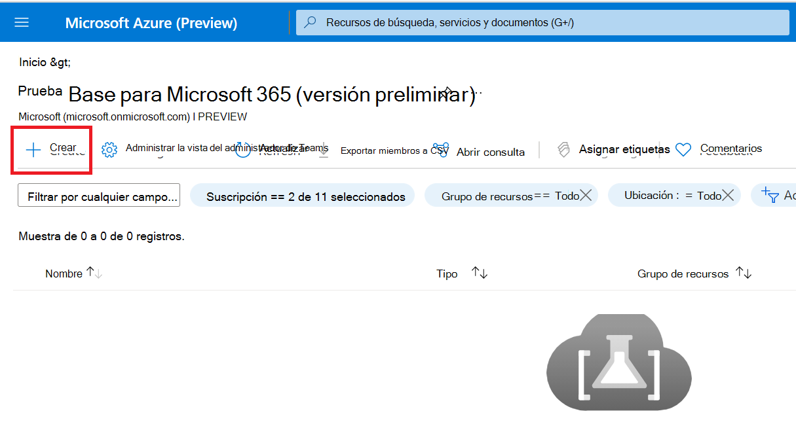
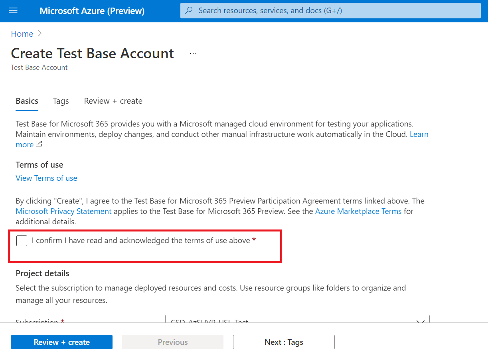
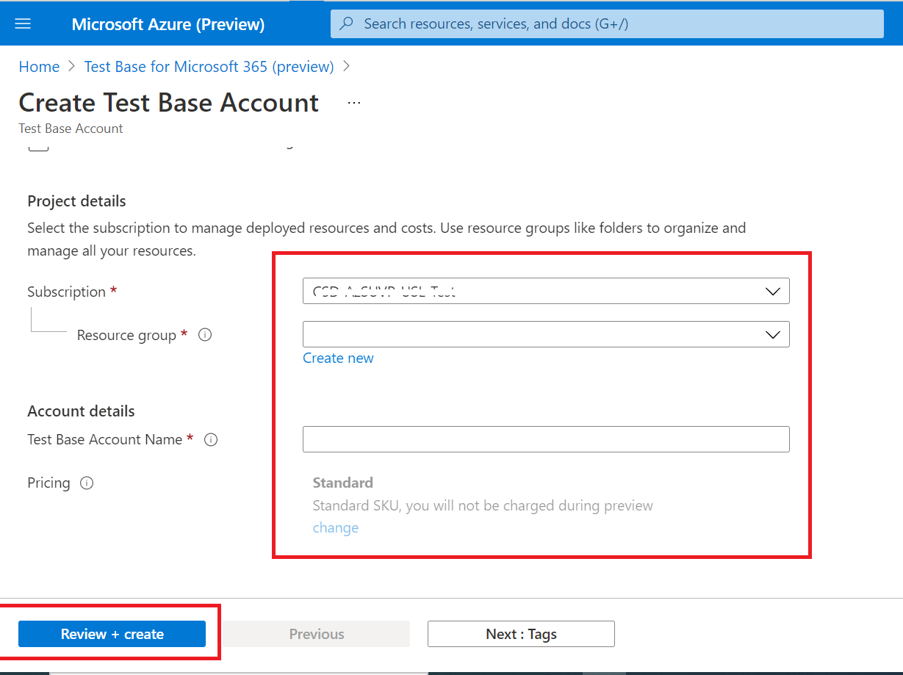

# <a name="step-1-create-a-test-base-account"></a>Paso 1: Crear una cuenta base de prueba

Si no tienes una suscripción a Azure, crea una [cuenta gratuita antes](https://azure.microsoft.com/en-us/free/) de empezar.

## <a name="enter-details-for-test-base-account"></a>Especificar detalles para la cuenta base de prueba
 
1. Busque **"Base de prueba"** en Azure Portal.


2. Haga **clic en "Agregar"** para crear una cuenta base de prueba.



3.  Lea la casilla ```Terms of Use``` de verificación para confirmar su satisfacción con el archivo ```Terms of Use``` .



4.  Rellene la información correcta en los siguientes requisitos: 
    -   Suscripción: Grupo de recursos
    -   Detalles de la instancia: Nombre.

**Actualmente, Test Base solo admite el nivel de precios estándar.**



5.  Por último, haga clic en ```Review + Create``` para validar y habilitar la cuenta recién creada.

## <a name="next-steps"></a>Pasos siguientes

Avance al siguiente artículo para empezar con step 2: **Learn how upload your package.**
> [!div class="nextstepaction"]
> [Paso siguiente](uploadApplication.md)

<!---
Add button for next page
-->
