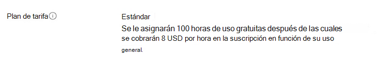
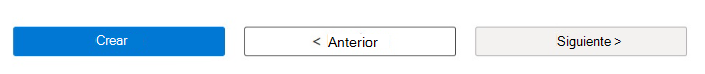

# Creación de una cuenta base de prueba

Para crear una cuenta **base de prueba** , realice los pasos siguientes. 

> [!IMPORTANT]
> Necesitará una suscripción para registrarse en una cuenta **base de prueba** . Si no tiene una suscripción de Azure, consulte **Suscripciones** en la página [principal de Azure](https://ms.portal.azure.com/#home) para obtener información sobre cómo crear una. 

## Para crear una cuenta base de prueba
 
1. En la página principal del [Azure Portal](https://ms.portal.azure.com/#home), busque Microsoft 365 en La **base de pruebas** en Azure Marketplace para mostrar los controles para crear una cuenta **de Base de prueba**. 

   > [!div class="mx-imgBorder"]
   > [ de pruebas de búsqueda ](Media/creatingaccount01-search.png#lightbox)

2. En el campo controles de la página **Base de pruebas para Microsoft 365**, seleccione el botón **Crear** como se indica a continuación para abrir la página **Crear cuenta base de prueba**. 

   > [!div class="mx-imgBorder"]
   > [ Base de prueba ](Media/creatingaccount02-testbase.png#lightbox)

3. En la página **Crear cuenta base de prueba** , agregue la información a los siguientes campos de entrada necesarios en la página **Crear cuenta base de prueba** : 

   - **Suscripción**: en la lista desplegable, busque el identificador de suscripción de Azure y selecciónelo. 
   - **Grupo de recursos**: cree un nuevo grupo de recursos seleccionando **Crear nuevo** y especificando un nombre elegido en el cuadro de texto **Entrada de nombre** que se muestra. Seleccione **Aceptar** cuando haya terminado. Si ya tiene un **grupo de recursos**, busque su nombre en la lista desplegable y selecciónelo. 
   - **Cuenta base de prueba**: en **Detalles** de la cuenta, como se muestra en la ilustración siguiente, especifique un nombre elegido para la cuenta **base de prueba** ; para ello, escónela en el campo de texto de entrada. 

   > [!NOTE]
   > Debe proporcionar la entrada para todos los campos obligatorios (*). 

   > [!div class="mx-imgBorder"]
   > [ Información básica ](Media/creatingaccount03-basics.png#lightbox)

   > [!NOTE]
   > A partir de abril de 2022, **Test Base** solo admite el plan de tarifa **Estándar** . **El plan de tarifa** determina el costo del recurso y del servicio por hora que se cobra a la suscripción de Azure. 

   > [!div class="mx-imgBorder"]
   > 

4. Lea los **Términos de uso**. Si los términos son aceptables, active la casilla para confirmar que ha leído y aceptado los términos de uso. 

   > [!div class="mx-imgBorder"]
   > 

5. En el sector inferior de la página **Crear cuenta base de prueba** , seleccione **Revisar y crear** para validar los datos de entrada especificados. 

   Si el proceso de validación se realiza correctamente, puede revisar la configuración de los datos de entrada en la página **Crear cuenta base de prueba** . 

   > [!div class="mx-imgBorder"]
   > 

6. Seleccione el botón **Crear** que se muestra en el sector inferior de la página **Crear cuenta base de prueba** anterior. 

   > [!div class="mx-imgBorder"]
   > 

7. En la página **Implementación del** usuario, seleccione **Ir al recurso** para abrir la nueva página Información general de la cuenta **base de pruebas** y comenzar la exploración, configuración y recorrido de **Test Base**. 

   > [!div class="mx-imgBorder"]
   > [ Creación completa ](Media/creatingaccount08-complete.png#lightbox)

