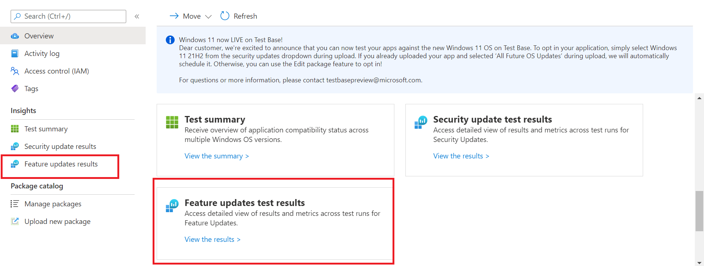

# <a name="windows-feature-update-validation"></a><span data-ttu-id="84e7c-103">Windows Validación de actualización de características</span><span class="sxs-lookup"><span data-stu-id="84e7c-103">Windows Feature update validation</span></span>

<span data-ttu-id="84e7c-104">¿Necesita información sobre el rendimiento de las aplicaciones con la próxima versión de Windows 10 o Windows 11, sin que mantenga un entorno para validar nuevas características Windows aplicaciones?</span><span class="sxs-lookup"><span data-stu-id="84e7c-104">Do you need insights on how your applications will perform with the next release of Windows 10 or Windows 11 - without you maintaining an environment to validate new Windows features?</span></span> 

<span data-ttu-id="84e7c-105">¿Desea ejecutar las pruebas de validación en Windows compilaciones del programa Insider en nuestro entorno de Azure?</span><span class="sxs-lookup"><span data-stu-id="84e7c-105">Do you want to run your validation tests against Windows Insider Program builds in our Azure environment?</span></span>

<span data-ttu-id="84e7c-106">**La validación de** actualización de características en Test Base para M365 puede ayudarle a lograr todos estos y más resultados.</span><span class="sxs-lookup"><span data-stu-id="84e7c-106">**Feature update** validation on Test Base for M365 can help you achieve all these and more!</span></span>

<span data-ttu-id="84e7c-107">Consulte el esquema paso a paso siguiente para averiguar cómo obtener acceso a esta nueva funcionalidad en Test Base para el servicio M365.</span><span class="sxs-lookup"><span data-stu-id="84e7c-107">Check out the step-by-step outline below to find out how to access this new capability in Test Base for M365 service.</span></span>

<span data-ttu-id="84e7c-108">Para empezar con test base para M365, cargue las aplicaciones (y los archivos relacionados) a través del ```Feature update validation``` portal de incorporación de autoservicio.</span><span class="sxs-lookup"><span data-stu-id="84e7c-108">To get started with ```Feature update validation``` in Test Base for M365, upload your applications (and related files) through the self-service onboarding portal.</span></span> 

<span data-ttu-id="84e7c-109">A continuación se indican los pasos que debe seguir al rellenar los detalles **de la prueba:**</span><span class="sxs-lookup"><span data-stu-id="84e7c-109">Highlighted below are the steps to take as you fill out the **Test details**:</span></span>

1. <span data-ttu-id="84e7c-110">Seleccione **Actualización de características** como tipo de actualización del sistema operativo:</span><span class="sxs-lookup"><span data-stu-id="84e7c-110">Select **Feature Update** as your OS update type:</span></span>


2. <span data-ttu-id="84e7c-112">Elija el Windows Insider channel con el que desea que se valide la aplicación.</span><span class="sxs-lookup"><span data-stu-id="84e7c-112">Choose the Windows Insider Channel against which you want your application validated.</span></span>  


3. <span data-ttu-id="84e7c-115">Seleccione una versión en el mercado de Windows 10 o Windows 11 como línea base para la prueba (y obtener información resultante) y proporcione los demás detalles necesarios para incorporar el paquete correctamente.</span><span class="sxs-lookup"><span data-stu-id="84e7c-115">Select an in-market release of Windows 10 or Windows 11 as the baseline for your test (and resulting insights!) and provide the other details required to onboard your package successfully.</span></span>


4. <span data-ttu-id="84e7c-117">Para ver los resultados de la validación de la aplicación en las actualizaciones de características Windows 10 versión anterior, visite ```Feature Updates Test Results``` el archivo .</span><span class="sxs-lookup"><span data-stu-id="84e7c-117">To view the results from the validation of your application against pre-released Windows 10 feature updates, visit the ```Feature Updates Test Results```.</span></span>




## <a name="next-steps"></a><span data-ttu-id="84e7c-119">Pasos siguientes</span><span class="sxs-lookup"><span data-stu-id="84e7c-119">Next steps</span></span>

<span data-ttu-id="84e7c-120">Avance al siguiente artículo para empezar a comprender el análisis de regresión de memoria.</span><span class="sxs-lookup"><span data-stu-id="84e7c-120">Advance to the next article to get started with understanding Memory regression analysis.</span></span>
> [!div class="nextstepaction"]
> [<span data-ttu-id="84e7c-121">Paso siguiente</span><span class="sxs-lookup"><span data-stu-id="84e7c-121">Next step</span></span>](memory.md)

<!---
Add button for next page
-->
