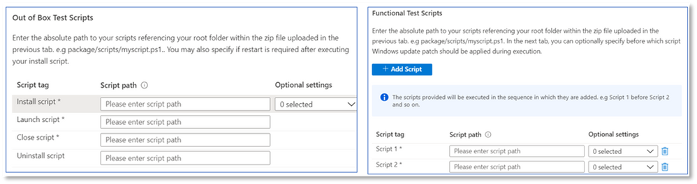

# <a name="functional-testing"></a>Pruebas de funcionamiento

Como proveedor de software, ahora puede realizar pruebas funcionales personalizadas con el marco de prueba que prefiera: a través del portal auto-serve Test Base for M365. 

Cuando iniciamos el servicio inicialmente, ofrecemos las pruebas de lista de pruebas, que es un conjunto predefinido de pruebas controladas a través de scripts estandarizados. Sin embargo, esto no pudo lograr la cobertura completa de pruebas para muchos proveedores de software independientes (ISV). 

Por lo tanto, en respuesta a sus comentarios, estamos proporcionando a nuestros ISV la capacidad de cargar pruebas funcionales automatizadas.

Para usar esta característica, siga los pasos siguientes:

1. Upload archivos (archivos binarios, dependencias y scripts) como un único .zip paquete.
2. Elija si desea reiniciar las máquinas virtuales (VM) de prueba en varios puntos de ejecución.
3. Administrar las opciones disponibles para los scripts.
4. Elija cuándo aplicar la actualización Windows la máquina virtual durante la ejecución.

A continuación se resaltan las descripciones detalladas de los pasos anteriores:

**Upload un paquete de prueba funcional**

Para empezar, vaya Upload la página Upload, seleccione una nueva aplicación en Catálogo de aplicaciones en el menú de navegación del lado izquierdo del portal Test Base for M365 en Azure. Desde allí:

Ficha 1: escriba información básica. Proporcione el nombre y la versión de la aplicación. En la opción Tipo de prueba, seleccione ```Functional tests``` . 

*Tenga en cuenta que la opción De fábrica (OOB) es obligatoria de forma predeterminada.*


Ficha 2: Upload los componentes del paquete cargando un archivo zip con toda la prueba (archivos binarios, dependencias, scripts, etc.). 

Vea aka.ms/usl-package-outline para obtener más información. (Nota: Tanto los scripts de prueba de lista para usar como el contenido de la prueba funcional deben colocarse en el mismo archivo zip). Actualmente, el tamaño del archivo está limitado a 2 GB.

Ficha 3: Configurar las tareas de pruebas de lista de pruebas y funcionales. Aquí, elija las rutas de acceso a los scripts de PowerShell que instalarán, iniciarán, cerrarán y desinstalarán la aplicación (para fuera de la caja), así como las rutas de acceso a todos los scripts personalizados para realizar la prueba funcional. **(Nota: Un script para desinstalar la aplicación es opcional).**

Actualmente, puede cargar entre 1 y 8 scripts para las pruebas funcionales. (Comentario amable en esta entrada si necesita más scripts!)



(Opcional) Configure un reinicio después de la instalación. Algunas aplicaciones requieren un reinicio después de la instalación. 

Seleccione el script específico en la pestaña Tareas si desea que se realice un reinicio ```Reboot After Execution``` después de la ejecución de ese script.

Ficha 4: elija cuándo se instala la actualización Windows: la aplicación de la revisión Windows Update se realiza antes de cualquier script de su elección. Se recomienda instalar una actualización de Windows después de la instalación de la aplicación para imitar estrechamente los escenarios de uso de aplicaciones reales.


Ficha 5: revisar y crear el paquete. Una vez que haya completado los pasos enumerados anteriormente, seleccione ```Create``` para finalizar el proceso de carga.

Una vez creado el paquete, puede comprobar el estado de comprobación del paquete.

Ejecutamos una prueba inicial para instalar, iniciar, cerrar y desinstalar la aplicación. Esto nos permite comprobar que el paquete se puede instalar en nuestro servicio sin errores.

El proceso de verificación podría tardar hasta 24 horas. Una vez completada la comprobación, puede ver el estado en el ```Manage packages``` menú, que sería una de las dos entradas:

1. La comprobación se realiza correctamente: el paquete se probará automáticamente con las actualizaciones Windows versiones anteriores a las compilaciones del sistema operativo que seleccionó.
o
2. Error en la comprobación: deberá investigar los motivos del error, corregir el problema y volver a cargar el paquete.

También se le notificará de cualquiera de los resultados a través del icono de notificación en Azure Portal.
