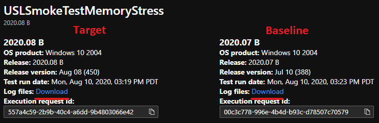

# <a name="memory-regression-analysis"></a><span data-ttu-id="6a708-103">Análisis de regresión de memoria</span><span class="sxs-lookup"><span data-stu-id="6a708-103">Memory Regression Analysis</span></span>

<span data-ttu-id="6a708-104">Test Base te ayuda a observar con mayor claridad aumentos significativos en el uso de memoria en las máquinas virtuales de prueba que ejecutan tus aplicaciones.</span><span class="sxs-lookup"><span data-stu-id="6a708-104">Test Base helps you more clearly notice significant memory usage increases in the test VMs running your apps.</span></span> <span data-ttu-id="6a708-105">Las métricas de rendimiento, como el uso de memoria, pueden ser indicativas del estado general de la aplicación y creemos que esta adición ayudará en gran medida a mantener el rendimiento óptimo de las aplicaciones.</span><span class="sxs-lookup"><span data-stu-id="6a708-105">Performance metrics, such as memory usage, can be indicative of overall application health and we believe this addition will greatly help keep your apps performing optimally.</span></span>

<span data-ttu-id="6a708-106">Sigue leyendo para obtener más información o ver este vídeo para obtener un rápido recorrido por las mejoras más recientes.</span><span class="sxs-lookup"><span data-stu-id="6a708-106">Read on for more details or watch this video for a quick walk through of the latest improvements.</span></span> 

<span data-ttu-id="6a708-107">Para obtener más información sobre la base de pruebas para la capacidad de M365 para ayudar con el análisis de regresión, consulte Resultados de regresión basados en la confiabilidad del proceso.</span><span class="sxs-lookup"><span data-stu-id="6a708-107">For more information on Test Base for M365's ability to help with regression analysis, see Regression results based on process reliability.</span></span>

<span data-ttu-id="6a708-108"><b>Mirar más de cerca las regresiónes de memoria</b></span><span class="sxs-lookup"><span data-stu-id="6a708-108"><b>Looking closer at memory regressions</b></span></span>

<span data-ttu-id="6a708-109">El panel Base de prueba para M365 muestra la memoria consumida por la aplicación en una nueva actualización de Windows publicada previamente y la compara con la memoria usada por la última actualización Windows lanzamiento.</span><span class="sxs-lookup"><span data-stu-id="6a708-109">The Test Base for M365 dashboard shows the memory consumed by your application on a new pre-released Windows update and compares it with the memory used by the last released Windows update.</span></span> 

<span data-ttu-id="6a708-110">Con las mejoras de este mes, el análisis de regresión de memoria ahora se presenta en los procesos favoritos.</span><span class="sxs-lookup"><span data-stu-id="6a708-110">With this month’s enhancements, memory regression analysis is now featured in your favorited processes.</span></span> <span data-ttu-id="6a708-111">Las aplicaciones pueden contener varios procesos y puede seleccionar manualmente sus procesos favoritos a través de la pestaña Confiabilidad. A continuación, nuestro servicio identificará las regresiónes de memoria en estos procesos favoritos mientras compara las ejecuciones de prueba en diferentes Windows actualizaciones.</span><span class="sxs-lookup"><span data-stu-id="6a708-111">Applications can contain multiple processes and you can manually select your favorite processes through the Reliability tab. Our service will then identify memory regressions in these favorited processes while comparing test runs across different Windows update releases.</span></span> <span data-ttu-id="6a708-112">Si se detecta una regresión, los detalles sobre la regresión estarán disponibles fácilmente.</span><span class="sxs-lookup"><span data-stu-id="6a708-112">If a regression is detected, details about the regression are easily available.</span></span>

<span data-ttu-id="6a708-113">Ahora echemos un vistazo a esta característica en detalle y analicemos cómo puede solucionar problemas de regresión de memoria con Windows analizador de rendimiento.</span><span class="sxs-lookup"><span data-stu-id="6a708-113">Now let's look at this feature in detail and discuss how you can troubleshoot memory regressions using Windows Performance Analyzer.</span></span>

<span data-ttu-id="6a708-114">La señal de error causada por una regresión de memoria se muestra en el panel Base de pruebas para M365 en la página Resultados de la prueba en Uso de memoria:</span><span class="sxs-lookup"><span data-stu-id="6a708-114">The failure signal caused by a memory regression is shown in the Test Base for M365 dashboard on the Test results page under Memory Utilization:</span></span>


<span data-ttu-id="6a708-116">Error en la aplicación debido a un mayor consumo de memoria, también se mostrará como en ```Fail``` la página Resumen de prueba:</span><span class="sxs-lookup"><span data-stu-id="6a708-116">Failure for the application due to higher memory consumption, will also be displayed as ```Fail``` on the Test Summary page:</span></span>


<span data-ttu-id="6a708-118">Al proporcionar estas señales de error por adelantado, nuestro objetivo es marcar claramente los posibles problemas que pueden interrumpir e afectar a la experiencia del usuario final de la aplicación.</span><span class="sxs-lookup"><span data-stu-id="6a708-118">By providing these failure signals upfront, our goal is to clearly flag potential issues that can disrupt and impact the end user experience for your application.</span></span> 

<span data-ttu-id="6a708-119">A continuación, puede descargar los archivos de registro y usar el analizador de rendimiento Windows, o el kit de herramientas preferido, para investigar más.</span><span class="sxs-lookup"><span data-stu-id="6a708-119">You can then download the log files and use the Windows Performance Analyzer, or your preferred toolkit, to investigate further.</span></span> <span data-ttu-id="6a708-120">También puede trabajar conjuntamente con el equipo de Test Base para M365 para solucionar el problema y ayudar a evitar problemas que afectan a los usuarios finales.</span><span class="sxs-lookup"><span data-stu-id="6a708-120">You can also work jointly with the Test Base for M365 team on remediating the issue and help prevent issues impacting end users.</span></span>

<span data-ttu-id="6a708-121">Las señales de memoria se capturan en la pestaña Uso de memoria del servicio Base de prueba para M365 para todas las ejecuciones de prueba.</span><span class="sxs-lookup"><span data-stu-id="6a708-121">Memory signals are captured in the Memory Utilization tab in the Test Base for M365 service for all test runs.</span></span> <span data-ttu-id="6a708-122">En el ejemplo siguiente se muestra una ejecución de prueba reciente con la aplicación incorporada "Estrés de memoria de prueba de humo" en la actualización de seguridad de agosto de 2020.</span><span class="sxs-lookup"><span data-stu-id="6a708-122">The example below shows a recent test run with the onboarded application “Smoke Test Memory Stress” against the pre-release August 2020 security update.</span></span> <span data-ttu-id="6a708-123">(Nuestro equipo escribió esta aplicación para ilustrar las regresión de la memoria).</span><span class="sxs-lookup"><span data-stu-id="6a708-123">(This application was written by our team to illustrate memory regressions.)</span></span>


<span data-ttu-id="6a708-125">En este ejemplo, el proceso favorito "USLTestMemoryStress.exe" consumió un promedio de aproximadamente 100 MB en la actualización de agosto anterior a la actualización de julio publicada, de ahí que la Base de pruebas para M365 identificara una regresión.</span><span class="sxs-lookup"><span data-stu-id="6a708-125">In this example, the favorite process “USLTestMemoryStress.exe” process consumed an average of approximately 100 MB on the pre-release August update compared to the released July update, hence the Test Base for M365 identified a regression.</span></span> 

<span data-ttu-id="6a708-126">Los otros procesos,que se muestran aquí como "USLTestMemoryStress_Aux1.exe" y "USLTestMemoryStress_Aux2.exe", también pertenecen a la misma aplicación, pero consumen aproximadamente la misma cantidad de memoria para las dos versiones, por lo que "pasaron" y se consideraron correctos.</span><span class="sxs-lookup"><span data-stu-id="6a708-126">The other processes—shown here as “USLTestMemoryStress_Aux1.exe” and “USLTestMemoryStress_Aux2.exe”—also belong to the same application, but consumed approximately the same amount of memory for the two releases so they "passed" and were considered healthy.</span></span>

<span data-ttu-id="6a708-127">La regresión en el proceso principal se determinó como "estadísticamente significativa" por lo que el servicio se comunicó y resaltó esta diferencia al usuario.</span><span class="sxs-lookup"><span data-stu-id="6a708-127">The regression on the main process was determined to be “statistically significant” so the service communicated and highlighted this difference to the user.</span></span> <span data-ttu-id="6a708-128">Si la comparación no fuera estadísticamente significativa, no se resaltaría.</span><span class="sxs-lookup"><span data-stu-id="6a708-128">If the comparison was not statistically significant, it would not be highlighted.</span></span> <span data-ttu-id="6a708-129">El uso de memoria puede ser ruidoso, por lo que usamos modelos estadísticos para distinguir, entre compilaciones y versiones, diferencias significativas de diferencias intrascendentes.</span><span class="sxs-lookup"><span data-stu-id="6a708-129">Memory utilization can be noisy, so we use statistical models to distinguish, across builds and releases, meaningful differences from inconsequential differences.</span></span> 

<span data-ttu-id="6a708-130">Es posible que rara vez se señale una comparación cuando no hay ninguna diferencia verdadera (un falso positivo), pero esto es una contraoferta necesaria para mejorar la probabilidad de identificar correctamente regresión (o verdaderos positivos).</span><span class="sxs-lookup"><span data-stu-id="6a708-130">A comparison may rarely be flagged when there is no true difference (a false positive), but this is a necessary tradeoff to improve the likelihood of correctly identifying regressions (or true positives.)</span></span>

<span data-ttu-id="6a708-131">El siguiente paso es comprender qué causó la regresión de la memoria.</span><span class="sxs-lookup"><span data-stu-id="6a708-131">The next step is to understand what caused the memory regression.</span></span> <span data-ttu-id="6a708-132">Puede descargar los archivos zip para ambas ejecuciones desde la opción Descargar archivos de registro, como se muestra a continuación.</span><span class="sxs-lookup"><span data-stu-id="6a708-132">You can download the zip files for both executions from the Download log files option, as shown below.</span></span> 

<span data-ttu-id="6a708-133">Estos archivos zip contienen los resultados de la ejecución de prueba, incluidos los resultados del script y la memoria y los datos de rendimiento de la CPU que se incluyen en el archivo ETL.</span><span class="sxs-lookup"><span data-stu-id="6a708-133">These zip files contain the results of your test run, including script results and memory and CPU performance data which is included in the ETL file.</span></span>



<span data-ttu-id="6a708-135">Puede descargar y descomprimir los registros de las dos ejecuciones de prueba, localizar el archivo ETL en cada carpeta y cambiar su nombre como target.etl (para la ejecución de prueba en la actualización de versión anterior) y baseline.etl (para la ejecución de prueba en la última actualización publicada) para simplificar la exploración y la navegación.</span><span class="sxs-lookup"><span data-stu-id="6a708-135">You can download and unzip the logs for the two test runs, then locate the ETL file within each folder and rename them as target.etl (for the test run on the pre-release update) and baseline.etl (for the test run on last released update) to simplify exploration and navigation.</span></span>
 
## <a name="next-steps"></a><span data-ttu-id="6a708-136">Pasos siguientes</span><span class="sxs-lookup"><span data-stu-id="6a708-136">Next steps</span></span>

<span data-ttu-id="6a708-137">Avance al siguiente artículo para empezar a comprender el análisis de regresión inteligente de la CPU.</span><span class="sxs-lookup"><span data-stu-id="6a708-137">Advance to the next article to get started with understanding intelligent CPU regression analysis.</span></span>
> [!div class="nextstepaction"]
> [<span data-ttu-id="6a708-138">Paso siguiente</span><span class="sxs-lookup"><span data-stu-id="6a708-138">Next step</span></span>](cpu.md)

<!---
Add button for next page
-->
