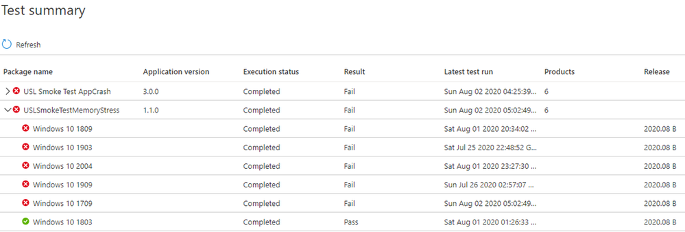

# <a name="memory-regression-analysis"></a>Análisis de regresión de memoria

Test Base le ayuda a observar con mayor claridad un aumento significativo del uso de memoria en las máquinas virtuales de prueba que ejecutan las aplicaciones. Las métricas de rendimiento, como el uso de memoria, pueden indicar el estado general de la aplicación y creemos que esta adición ayudará en gran medida a mantener el rendimiento óptimo de las aplicaciones.

Siga leyendo para obtener más detalles o vea este vídeo para obtener un tutorial rápido de las mejoras más recientes. 

Para obtener más información sobre la capacidad de Test Base for Microsoft 365 para ayudar con el análisis de regresión, consulte Resultados de regresión basados en la confiabilidad del proceso.

<b>Examinar más de cerca las regresiones de memoria</b>

El panel Test Base for Microsoft 365 muestra la memoria consumida por la aplicación en una nueva actualización de Windows publicada previamente y la compara con la memoria usada por la última actualización de Windows publicada. 

Con las mejoras de este mes, el análisis de regresión de memoria ahora aparece en los procesos favoritos. Las aplicaciones pueden contener varios procesos y puede seleccionar manualmente sus procesos favoritos a través de la pestaña Confiabilidad. A continuación, nuestro servicio identificará las regresiones de memoria en estos procesos favoritos mientras compara las ejecuciones de prueba en diferentes versiones de Windows Update. Si se detecta una regresión, los detalles sobre la regresión están disponibles fácilmente.

Ahora echemos un vistazo a esta característica en detalle y analicemos cómo solucionar problemas de regresiones de memoria mediante Windows Analizador de rendimiento.

La señal de error causada por una regresión de memoria se muestra en el panel Base de pruebas para Microsoft 365 de la página Resultados de la prueba en Uso de memoria:


El error de la aplicación debido a un mayor consumo de memoria también se mostrará como ```Fail``` en la página Resumen de la prueba:



Al proporcionar las señales de error por adelantado, nuestro objetivo es marcar claramente los posibles problemas que pueden interrumpir e afectar a la experiencia del usuario final de la aplicación. 

A continuación, puede descargar los archivos de registro y usar el Analizador de rendimiento de Windows, o el kit de herramientas que prefiera, para investigar más. También puede trabajar conjuntamente con el equipo de Test Base for Microsoft 365 para corregir el problema y ayudar a evitar problemas que afecten a los usuarios finales.

Las señales de memoria se capturan en la pestaña Uso de memoria del servicio Test Base for Microsoft 365 para todas las ejecuciones de prueba. En el ejemplo siguiente se muestra una ejecución de prueba reciente con la aplicación incorporada "Smoke Test Memory Stress" con respecto a la actualización de seguridad anterior a la versión preliminar de agosto de 2020. (Esta aplicación fue escrita por nuestro equipo para ilustrar las regresiones de memoria).


En este ejemplo, el proceso favorito "USLTestMemoryStress.exe" consumió un promedio de aproximadamente 100 MB en la actualización de agosto anterior a la publicación en comparación con la actualización publicada en julio, por lo que la Base de pruebas para Microsoft 365 identificó una regresión. 

Los demás procesos, que se muestran aquí como "USLTestMemoryStress_Aux1.exe" y "USLTestMemoryStress_Aux2.exe", también pertenecen a la misma aplicación, pero consumen aproximadamente la misma cantidad de memoria para las dos versiones, por lo que "pasaron" y se consideraron correctos.

La regresión en el proceso principal se determinó como "estadísticamente significativa", por lo que el servicio comunicó y resaltó esta diferencia al usuario. Si la comparación no fuera estadísticamente significativa, no se resaltaría. El uso de memoria puede ser ruidoso, por lo que usamos modelos estadísticos para distinguir, entre compilaciones y versiones, diferencias significativas de diferencias inconsecuenciales. 

Una comparación rara vez se puede marcar cuando no hay ninguna diferencia verdadera (un falso positivo), pero se trata de un equilibrio necesario para mejorar la probabilidad de identificar correctamente regresiones (o verdaderos positivos).

El siguiente paso es comprender qué causó la regresión de memoria. Puede descargar los archivos ZIP de ambas ejecuciones desde la opción Descargar archivos de registro, como se muestra a continuación. 

Estos archivos ZIP contienen los resultados de la ejecución de prueba, incluidos los resultados del script y los datos de rendimiento de memoria y CPU que se incluyen en el archivo ETL.


Puede descargar y descomprimir los registros de las dos ejecuciones de prueba y, a continuación, buscar el archivo ETL dentro de cada carpeta y cambiarles el nombre como target.etl (para la prueba que se ejecuta en la actualización anterior a la versión) y baseline.etl (para la prueba que se ejecuta en la última actualización publicada) para simplificar la exploración y la navegación.
 
## <a name="next-steps"></a>Siguientes pasos

Pase al siguiente artículo para empezar a comprender el análisis inteligente de regresión de CPU.
> [!div class="nextstepaction"]
> [Paso siguiente](cpu.md)

<!---
Add button for next page
-->
