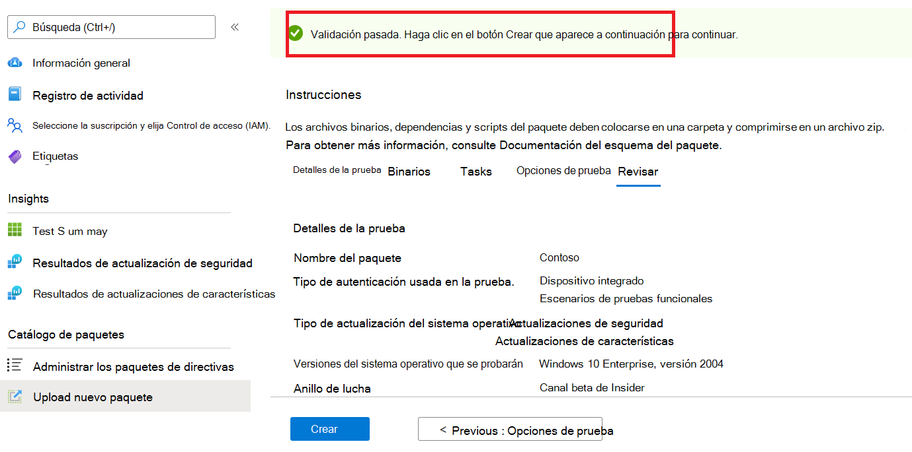

# <a name="step-6-review-your-selections-to-create-your-package"></a>Paso 6: Revisar las selecciones para crear el paquete.

1.  En esta pestaña, el servicio muestra los detalles de la prueba y ejecuta una comprobación de integridad rápida. 

    A ```Validation passed``` o message shows whether you can proceed to next steps or ```Validation failed``` not.

2.  Revise los detalles de la prueba y, si se cumple, haga clic en el ```Create``` botón. 



3.  Esto incorporará el paquete al entorno base de prueba. Si el paquete se crea correctamente, se desencadenará una prueba automatizada que compruebe si el paquete se puede ejecutar correctamente en Azure.


> [!Note]
> Recibirá una notificación de Azure Portal para notificarle sobre el éxito o el error de la comprobación del paquete. 
>
> Tenga en cuenta que el proceso puede tardar hasta 24 horas, por lo que es probable que la página web agote el tiempo de espera si no está activo en él y, por lo tanto, la notificación no le informará de la finalización de esta ejecución a petición. 

  - Peradventure esto sucede, puedes ver el estado del paquete en la ```Manage packages``` pestaña.


  - Para las pruebas de éxito, sus resultados se pueden ver a través de las páginas y a intervalos programados, a menudo a partir de unos días ```Test Summary``` ```Security Updates Results``` después de la ```Feature Updates Results``` carga.
  
  - Si bien se han fallado las pruebas, es necesario cargar un nuevo paquete. 
  
    Puede descargar el ```test logs``` análisis para obtener más información desde las páginas ' ```Security update results``` ```Feature updates results``` y.

  - Si experimenta errores de prueba repetidos, póngase en contacto testbasepreview@microsoft.com con los detalles del error. 

## <a name="next-steps"></a>Pasos siguientes

Descubra nuestras Directrices de contenido a través del siguiente vínculo.
> [!div class="nextstepaction"]
> [Paso siguiente](contentguideline.md)
