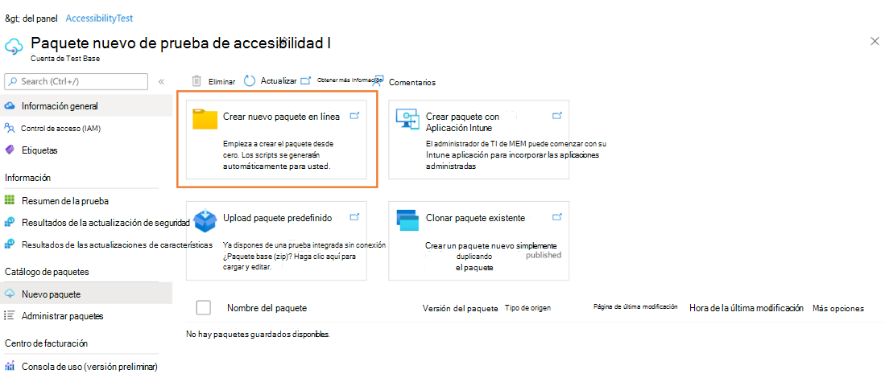
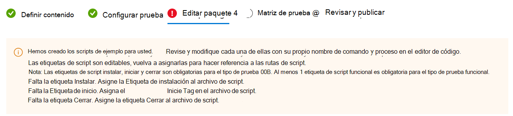

# Creación y prueba de archivos binarios en la base de pruebas

En esta sección se proporcionan todos los pasos necesarios para crear un nuevo paquete que contenga archivos binarios para cargar y probar en Test Base. Si ya tiene un archivo .zip precompilado, puede ver [Carga del paquete Zip precompilado](uploadApplication.md) para cargar el archivo.

> [!IMPORTANT]
> Si no tiene una cuenta base de **prueba** , deberá crear una antes de continuar, como se describe en [Creación de una cuenta base de prueba](createAccount.md).

## Creación de un nuevo paquete

En el [Azure Portal](https://portal.azure.com/), vaya a la cuenta base de **prueba** para la que va a crear y cargar el paquete y realice los pasos siguientes. 

En el menú de la izquierda, en **Catálogo de paquetes**, seleccione nuevo **paquete**. A continuación, haga clic en la primera tarjeta **"Crear nuevo paquete en línea"** para compilar el paquete en línea dentro de los 5 pasos!

> [!div class="mx-imgBorder"]
> 

### Paso 1. Definir contenido

1. En la sección **Origen del paquete** , seleccione Archivos binarios (por ejemplo: .exe, .msi) en Tipo de origen del paquete.

   > [!div class="mx-imgBorder"]
   > 

2. A continuación, cargue el archivo de la aplicación haciendo clic en el botón "Seleccionar archivo" o marcando la casilla para usar la plantilla de ejemplo base de prueba como punto de partida si aún no tiene el archivo listo.

   > [!div class="mx-imgBorder"]
   > 

3. Escriba el nombre y la versión del paquete en la sección **Información básica** .

   > [!NOTE]
   > La combinación del nombre y la versión del paquete debe ser única dentro de la cuenta base de prueba.

   > [!div class="mx-imgBorder"]
   > 

4. Una vez especificada toda la información solicitada, puede pasar a la siguiente fase haciendo clic en el botón **Siguiente: Prueba de configuración** .

   > [!div class="mx-imgBorder"]
   > 

### Paso 2. Configuración de la prueba

1. Seleccione el **tipo de prueba**. Se admiten dos tipos de prueba:
   - Una **prueba lista para usar (OOB)** realiza una instalación, inicio, cierre y desinstalación del paquete. Después de la instalación, la rutina de inicio y cierre se repite 30 veces antes de que se ejecute una sola desinstalación. La prueba de OOB proporciona telemetría estandarizada en el paquete para compararlo entre compilaciones de Windows.
   - Una **prueba funcional** ejecutaría los scripts de prueba cargados en el paquete. Los scripts se ejecutan en la secuencia especificada y un error en un script determinado impedirá la ejecución de scripts posteriores.

   > [!NOTE]
   > Ahora, la prueba lista para usar es opcional.

   > [!div class="mx-imgBorder"]
   > 

2. Una vez rellenada toda la información necesaria, puede pasar al paso 3 haciendo clic en el botón Siguiente situado en la parte inferior. Aparecerá una notificación cuando los scripts de prueba se generen correctamente.

   > [!div class="mx-imgBorder"]
   > 

### Paso 3. Editar paquete

1. En la pestaña Editar paquete, puede
   - Compruebe la carpeta del paquete y la estructura de archivos en **la versión preliminar del paquete**.
   - Edite los scripts en línea con el **editor de código de PowerShell**.

   > [!NOTE]
   > Se han generado algunos scripts de ejemplo para la referencia. Debe revisar cuidadosamente cada script y reemplazar el comando y el nombre del proceso por el suyo propio. 

   > [!div class="mx-imgBorder"]
   > 

2. En la **versión preliminar del paquete**, según sus necesidades, puede
   - Cree una nueva carpeta.
   - Cree un nuevo script.
   - Cargue un archivo nuevo.

   > [!div class="mx-imgBorder"]
   > 

3. En **la carpeta scripts**, se han creado scripts de ejemplo y etiquetas de script automáticamente. Todas las etiquetas de script son editables, puede reasignarlas para hacer referencia a las rutas de acceso de script.
   - Si la **prueba lista** para usar está seleccionada en el paso 2, puede ver la carpeta **outofbox** en la carpeta scripts. También tiene la opción de agregar la etiqueta **"Reiniciar después de la instalación"** para el script de instalación.

   > [!div class="mx-imgBorder"]
   > 

   > [!NOTE]
   > Las etiquetas de script Install, Launch y Close son obligatorias para el tipo de prueba de OOB. La reasignación de etiquetas garantiza que se usará la ruta de acceso de script correcta cuando se inicien las pruebas.

   > [!div class="mx-imgBorder"]
   > 

   - Si la **prueba funcional** está seleccionada en el paso 2, puede ver la carpeta **funcional** en la carpeta scripts. Se pueden agregar scripts de prueba más funcionales mediante el botón **"Agregar a la lista de pruebas funcionales"** . Necesita un script mínimo de (1) y puede agregar hasta ocho (8) scripts de prueba funcionales.

   > [!div class="mx-imgBorder"]
   > 

   > [!NOTE]
   > Al menos 1 etiqueta de script funcional es obligatoria para el tipo de prueba funcional.

   Para agregar más scripts funcionales, puede hacer clic en la **lista "Agregar a la prueba funcional"**. A continuación, aparecerá el panel de acciones, puede hacer lo siguiente:
   - Reordene las rutas de acceso del script arrastrando con los botones de puntos suspensivos izquierdos. Los scripts funcionales se ejecutan en la secuencia en la que aparecen. Un error en un script determinado impide que se ejecuten scripts posteriores.
   - Establezca "Reiniciar después de la ejecución" para varios scripts.
   - Aplique la actualización antes en una ruta de acceso de script específica. Esto es para los usuarios que desean realizar pruebas funcionales para indicar cuándo se debe aplicar la revisión de Windows Update en la secuencia de ejecución de sus scripts de prueba funcionales.

   > [!div class="mx-imgBorder"]
   > 

4. Una vez rellenada toda la información necesaria, puede pasar al paso 4 haciendo clic en el botón Siguiente de la parte inferior.

### Paso 4. Establecer matriz de prueba

La pestaña Matriz de pruebas le permite indicar el programa de actualización de Windows específico o el producto de Windows en el que puede que desee que se ejecute la prueba.

   > [!div class="mx-imgBorder"]
   > 

1. Elegir **tipo de actualización del sistema operativo**
   - Test Base proporciona pruebas programadas para asegurarse de que el rendimiento de las aplicaciones no se verá interrumpido por las últimas actualizaciones de Windows. 

   > [!div class="mx-imgBorder"]
   > 

   - Hay 2 opciones disponibles:
   
     - Las **actualizaciones de seguridad** permiten probar el paquete con renovaciones incrementales de actualizaciones de seguridad mensuales de Windows.
     - Las **actualizaciones de características** permiten probar el paquete con las nuevas características de las compilaciones de Windows Insider Preview más recientes del programa Windows Insider.

2. Configurar **actualización de seguridad** Para configurar las actualizaciones de seguridad, debe especificar los productos de Windows con los que desea realizar la prueba en la lista desplegable de "Versiones del sistema operativo que se van a probar".

   > [!div class="mx-imgBorder"]
   > 

   - La selección registrará la aplicación para las ejecuciones de pruebas automáticas en la versión B de las actualizaciones de calidad mensuales de Windows de los productos seleccionados.
     - Para los clientes que tienen clientes de acceso predeterminado en Test Base, sus aplicaciones se validan con respecto a la versión final de las actualizaciones de seguridad de la versión B, a partir del martes de revisión.
     - Para los clientes que tienen clientes de acceso completo en La base de pruebas, sus aplicaciones se validan con respecto a las versiones preliminares de las actualizaciones de seguridad de la versión B, a partir de 3 semanas antes del martes de revisión. Esto permite que los clientes de acceso completo tengan tiempo para tomar medidas proactivas para resolver los problemas detectados durante las pruebas antes de la versión final del martes de revisión.  
       (¿Cómo convertirse en un cliente de acceso completo? Consulte [Solicitud para cambiar el nivel de acceso | Microsoft Docs](accesslevel.md))

3. Configuración **de la actualización de características**
   - Para configurar las actualizaciones de características, debe especificar el producto de destino y su canal de vista previa en la lista desplegable "Canal insider".

   > [!div class="mx-imgBorder"]
   > 

   - La selección registrará la aplicación para que se ejecuten pruebas automáticas con las últimas actualizaciones de características del canal de producto seleccionado y todas las actualizaciones nuevas futuras en las últimas Windows Insider Preview compilaciones de la selección.

   - También puede establecer el sistema operativo actual en "Línea de base del sistema operativo para Insight". Le proporcionaremos más información de prueba mediante el análisis de regresión del entorno del sistema operativo tal cual y el sistema operativo de destino más reciente.

   > [!div class="mx-imgBorder"]
   > 

### Paso 5. Revisar y publicar

1. Revise toda la información para ver si el paquete es correcto y preciso. Para realizar correcciones, puede volver a los pasos iniciales en los que especificó la configuración según sea necesario.

   > [!div class="mx-imgBorder"]
   > 

2. También puede activar la casilla de notificación para recibir la notificación por correo electrónico del paquete para el aviso de finalización de la ejecución de validación.

   > [!div class="mx-imgBorder"]
   > 

3. Cuando haya terminado de finalizar la configuración de datos de entrada, haga clic en **Publicar** para cargar el paquete en Test Base.  La notificación siguiente se muestra cuando el paquete se publica correctamente y ha entrado en el proceso de verificación.  

   > [!NOTE]
   > El paquete debe comprobarse antes de que se acepte para futuras pruebas. La comprobación puede tardar hasta 24 horas, ya que incluye la ejecución del paquete en un entorno de prueba real. 

   > [!div class="mx-imgBorder"]
   > 

4. Se le redirigirá a la página **Administrar paquetes** para comprobar el progreso del paquete recién cargado.

   > [!div class="mx-imgBorder"]
   > 

   > [!NOTE]
   > Cuando se complete el proceso de verificación, el estado de verificación cambiará a Aceptado. En este momento, no se requieren más acciones. El paquete se adquirirá automáticamente para su ejecución cada vez que los sistemas operativos configurados tengan nuevas actualizaciones disponibles. Si se produce un error en el proceso de verificación, el paquete no está listo para las pruebas. Compruebe los registros y evalúe si se han producido errores. También es posible que tenga que comprobar los valores de configuración del paquete para detectar posibles problemas.

### Reanudación de la creación de un paquete de borrador guardado

Si tiene algún paquete de borrador anterior, puede ver la lista de los paquetes de borrador guardados en la página **Nuevo paquete** . Al hacer clic en el icono de lápiz **"Editar"** , puede reanudar la edición del paquete seleccionado desde donde lo dejó, como se describe en la columna **Estado** .

> [!div class="mx-imgBorder"]
> 

> [!NOTE]
> El panel solo muestra los paquetes de borrador guardados. Para ver los paquetes publicados, deberá ir a la página Administrar paquetes.

