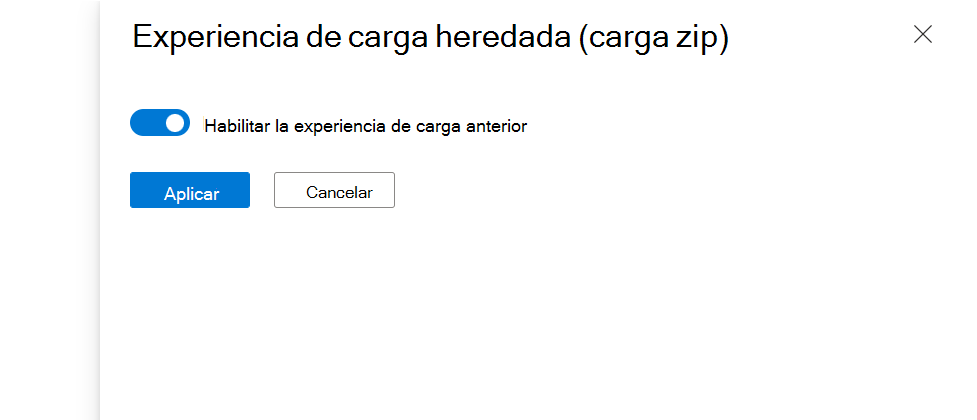

# Paquete de archivos binarios de prueba en Test Base
> [!NOTE]
> Esta guía le guiará para crear un nuevo paquete base de prueba desde cero. Si ya tiene un paquete de Test Base (.zip) en la mano, puede cambiar para usar nuestra experiencia de carga heredada [Upload el paquete base de prueba (Zip).](uploadApplication.md)

## Requisitos previos
Una cuenta base de prueba. Si no tiene una, [cree una cuenta base de prueba](createAccount.md).

## Creación de un nuevo paquete
En el [Azure Portal](https://portal.azure.com/), vaya a la cuenta base de prueba en la que desea cargar el paquete. En el menú de la izquierda, en **Catálogo de paquetes**, seleccione nuevo **paquete**. A continuación, haga clic en la primera tarjeta **"Crear nuevo paquete"** para compilar el paquete en 5 pasos.

> [!div class="mx-imgBorder"]
> 

  
**Paso 1. Definir contenido**
1. En la sección **Origen del** paquete, elija el origen del paquete. Si tiene una aplicación Intunewin, seleccione Intunewin, para otros, por ejemplo, exe o msi, seleccione Archivos binarios.  
    
    > [!div class="mx-imgBorder"]
    > 

2. A continuación, cargue el archivo de la aplicación haciendo clic en el botón "Seleccionar archivo" o marcando la casilla para usar la plantilla de ejemplo base de prueba como punto de partida si aún no tiene el archivo listo.
    
    > [!div class="mx-imgBorder"]
    > 
  
3. Escriba el nombre y la versión del paquete en la sección **Información básica** .  
    > [!Note]
    > La combinación del nombre y la versión del paquete debe ser única dentro de la cuenta base de prueba.
    
    > [!div class="mx-imgBorder"]
    > 
  
4. Una vez rellenada toda la información necesaria, puede pasar al paso 2 haciendo clic en el botón Siguiente situado en la parte inferior.
    
    > [!div class="mx-imgBorder"]
    > 

  
**Paso 2. Configuración de la prueba**
1. Seleccione el **tipo de prueba**. Se admiten dos tipos de prueba: 
    - Una **prueba lista para usar (OOB)** realiza una instalación, inicio, cierre y desinstalación del paquete. Después de la instalación, la rutina de inicio y cierre se repite 30 veces antes de que se ejecute una sola desinstalación. La prueba de OOB proporciona telemetría estandarizada en el paquete para compararla entre Windows compilaciones. 
    - Una **prueba funcional** ejecutaría los scripts de prueba cargados en el paquete. Los scripts se ejecutan en la secuencia especificada y un error en un script determinado impedirá la ejecución de scripts posteriores. 
    
    > [!div class="mx-imgBorder"]
    > 
  
2. Una vez rellenada toda la información necesaria, puede pasar al paso 3 haciendo clic en el botón Siguiente situado en la parte inferior. Aparecerá una notificación cuando los scripts de prueba se generen correctamente. 
    
    > [!div class="mx-imgBorder"]
    > 

**Paso 3. Editar paquete**
1. En la pestaña Editar paquete, puede 
    - Compruebe la carpeta del paquete y la estructura de archivos en **la versión preliminar del paquete**. 
    - Edite los scripts en línea con el **editor de código de PowerShell**.
    
    > [!div class="mx-imgBorder"]
    > 
  
2. En la **versión preliminar del paquete**, según sus necesidades, puede 
    - Cree una nueva carpeta. 
    - Cree un nuevo script. 
    - Upload un archivo nuevo.  
    
    > [!div class="mx-imgBorder"]
    > 
  
3. En **la carpeta scripts**, se han creado scripts de ejemplo y etiquetas de script automáticamente. Todas las etiquetas de script son editables, puede reasignarlas para hacer referencia a las rutas de acceso de script.  
    - Si la **prueba lista** para usar está seleccionada en el paso 2, puede ver la carpeta **outofbox** en la carpeta scripts. También tiene la opción de agregar la etiqueta **"Reiniciar después de la instalación"** para el script de instalación.  
    
    > [!div class="mx-imgBorder"]
    >   
    
    > [!NOTE] 
    > Las etiquetas de script Install, Launch y Close son obligatorias para el tipo de prueba de OOB.  
    
    - Si la **prueba funcional** está seleccionada en el paso 2, puede ver la carpeta **funcional** en la carpeta scripts. Se pueden agregar scripts de prueba funcionales adicionales mediante el botón **"Agregar a la lista de pruebas funcionales"** . Necesita un script mínimo de (1) y puede agregar hasta ocho (8) scripts de prueba funcionales. 
    
    > [!div class="mx-imgBorder"]
    >  
  
    > [!NOTE] 
    > Al menos 1 etiqueta de script funcional es obligatoria para el tipo de prueba funcional.  
  
    Al hacer clic en la **lista "Agregar a la prueba funcional"**, aparecerá el panel de acciones, puede hacer lo siguiente: 
    - Reordene las rutas de acceso del script arrastrando con los botones de puntos suspensivos izquierdos. Los scripts funcionales se ejecutan en la secuencia en la que se enumeran. Un error en un script determinado impide que se ejecuten scripts posteriores.  
    - Establezca "Reiniciar después de la ejecución" para varios scripts. 
    - Aplique la actualización antes en una ruta de acceso de script específica. Esto es para los usuarios que desean realizar pruebas funcionales para indicar cuándo se debe aplicar la revisión de Windows Update en la secuencia de ejecución de sus scripts de prueba funcionales.   
    
    > [!div class="mx-imgBorder"]
    > 
  
4. Una vez rellenada toda la información necesaria, puede pasar al paso 4 haciendo clic en el botón Siguiente de la parte inferior.  

**Paso 4. Matriz de prueba**
1. En la pestaña Matriz de pruebas, seleccione el **tipo de actualización del sistema operativo**. Se admiten dos tipos de actualización del sistema operativo.
    -   Las **actualizaciones de seguridad** permiten probar el paquete con renovaciones incrementales de Windows actualizaciones de seguridad mensuales de versión preliminar.
    -   Las **actualizaciones de características** permiten probar el paquete con Windows compilaciones de actualizaciones de características bianuales anteriores a la versión del programa Windows Insider.
  
2. Seleccione las versiones del sistema operativo para las pruebas de actualización de seguridad. 
  Si **se selecciona Actualizaciones de seguridad** en tipo de actualización del sistema operativo, debe seleccionar las versiones del sistema operativo de Windows se probará el paquete.
    > [!NOTE] 
    > Si selecciona probar el paquete con los sistemas operativos servidor y cliente, asegúrese de que el paquete es compatible y se puede ejecutar en ambos sistemas operativos.
  
3. Seleccione las opciones de Pruebas de actualización de características.
    -   Si se selecciona **Actualizaciones de características** en tipo de actualización del sistema operativo, debe finalizar las siguientes opciones.
    -   En **Canal insider**, seleccione el Windows Canal de programa Insider como la compilación en la que se deben probar los paquetes. Actualmente usamos compilaciones piloto en el **canal beta de Insider**.
    -   En **Línea base del sistema operativo para Insight**, seleccione la versión Windows del sistema operativo que se usará como línea base al comparar los resultados de las pruebas.
    
    > [!div class="mx-imgBorder"]
    > 
   
4. Una vez rellenada toda la información necesaria, puede pasar al paso 5 (último paso) haciendo clic en el botón Siguiente situado en la parte inferior.

**Paso 5. Revisar y publicar**
1. puede revisar toda la información del paquete de borrador y puede volver a los pasos iniciales para realizar cambios si es necesario.  
    
    > [!div class="mx-imgBorder"]
    > 

2. También puede activar la casilla de notificación para recibir la notificación por correo electrónico del paquete para el aviso de finalización de la ejecución de validación.  
    
    > [!div class="mx-imgBorder"]
    > 

3. Una vez que se asegure de que toda la información es correcta, puede continuar con la carga del paquete en Test Base haciendo clic en el botón **"Publicar"** . Aparecerá una notificación cuando el paquete se haya publicado correctamente. 
    
    > [!div class="mx-imgBorder"]
    > 

4. Se le redirigirá a la página **Administrar paquetes** para comprobar el progreso del paquete recién cargado.  
    
    > [!div class="mx-imgBorder"]
    > 

  
**Continuar con la creación de paquetes** 

En la página **Nuevo paquete** , puede ver una lista de todos los paquetes de borrador guardados anteriormente. Puede continuar la edición directamente en el paso que detuvo la última vez haciendo clic en el icono "editar". 

> [!NOTE] 
> El panel solo muestra el paquete de trabajo en curso. Para el paquete publicado, puede comprobar la página Administrar paquete.

> [!div class="mx-imgBorder"]
> 

  
**Zip Upload (experiencia de carga heredada)** 

Si ya tiene un archivo Zip, puede volver a la experiencia de carga de paquetes heredada (carga zip). Obtenga más información sobre la carga zip [Upload el paquete | Microsoft Docs](uploadApplication.md). 

> [!div class="mx-imgBorder"]
> 

> [!div class="mx-imgBorder"]
> 
 
  
  
**Intunewin Upload Flow**  
Como parte de la hoja de ruta comercial, Test Base comenzó a admitir el formato intunewin para profesionales de TI que administran aplicaciones para sus aplicaciones dentro de Intune como el formato de paquete de incorporación estándar. El flujo de carga de intunewin proporciona la experiencia para que los profesionales de TI reutilicen sus paquetes de formato intunewin, que contienen las aplicaciones que implementaron en sus dispositivos finales a través de MEM/Intune para incorporar sus aplicaciones y probar configuraciones rápidamente en Test Base.
 

[Pruebe la aplicación de Intune en Test Base.](testintuneapplication.md)
