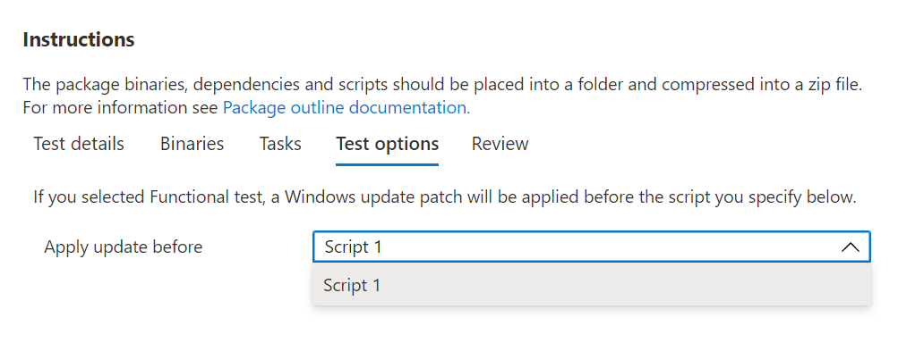

# <a name="step-5-choose-your-test-options"></a><span data-ttu-id="d3bd4-103">Paso 5: Elegir las opciones de prueba.</span><span class="sxs-lookup"><span data-stu-id="d3bd4-103">Step 5: Choose your test options.</span></span> 

<span data-ttu-id="d3bd4-104">La pestaña está para que los usuarios que deseen realizar pruebas funcionales indiquen cuándo se debe aplicar la revisión de actualización Windows en la secuencia de ejecución de sus scripts de prueba ```Test Options``` funcionales.</span><span class="sxs-lookup"><span data-stu-id="d3bd4-104">The ```Test Options``` tab is for users who wish to perform functional tests to indicate when the Windows Update patch should be applied in the sequence of executing their functional test scripts.</span></span>



<span data-ttu-id="d3bd4-107">Seleccione _**Revisar**_ para ir a la siguiente pestaña y revisar las opciones de prueba seleccionadas.</span><span class="sxs-lookup"><span data-stu-id="d3bd4-107">Select _**Review**_ to navigate to the next tab and review your selected test options.</span></span>

## <a name="next-steps"></a><span data-ttu-id="d3bd4-108">Pasos siguientes</span><span class="sxs-lookup"><span data-stu-id="d3bd4-108">Next steps</span></span>

<span data-ttu-id="d3bd4-109">Los detalles del paso de anidamiento se pueden ver en el siguiente artículo a través del vínculo siguiente:</span><span class="sxs-lookup"><span data-stu-id="d3bd4-109">Details of the nest step can be seen in the next article via the link below:</span></span>
> [!div class="nextstepaction"]
> [<span data-ttu-id="d3bd4-110">Paso siguiente</span><span class="sxs-lookup"><span data-stu-id="d3bd4-110">Next step</span></span>](review.md)
