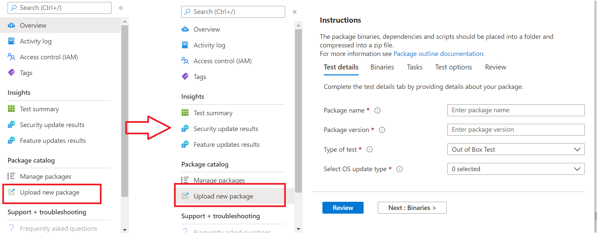

# <a name="step-2-uploading-a-package"></a><span data-ttu-id="89219-103">Paso 2: Cargar un paquete</span><span class="sxs-lookup"><span data-stu-id="89219-103">Step 2: Uploading a Package</span></span>

<span data-ttu-id="89219-104">En la página Del portal base de prueba, vaya a la opción "Upload nuevo paquete en la barra de navegación izquierda, como se muestra a continuación: Upload </span><span class="sxs-lookup"><span data-stu-id="89219-104">On the Test Base portal page, navigate to the ‘Upload new package option on the left navigation bar as shown below: </span></span>

<span data-ttu-id="89219-105">Una vez allí, siga los pasos siguientes para cargar un nuevo paquete.</span><span class="sxs-lookup"><span data-stu-id="89219-105">Once there, follow the steps below to upload a new package.</span></span>

## <a name="enter-details-for-your-package"></a><span data-ttu-id="89219-106">Escriba los detalles del paquete</span><span class="sxs-lookup"><span data-stu-id="89219-106">Enter details for your package</span></span>

<span data-ttu-id="89219-107">En la pestaña Detalles de prueba, escriba el nombre, la versión y otros detalles del paquete según lo solicitado.</span><span class="sxs-lookup"><span data-stu-id="89219-107">On the Test details tab, type in your package's name, version and other details as requested.</span></span> 

<span data-ttu-id="89219-108">**Las pruebas de configuración y** **funcionales** se pueden realizar a través de este panel.</span><span class="sxs-lookup"><span data-stu-id="89219-108">**Out-of-Box** and **Functional testing** can be done via this dashboard.</span></span>

<span data-ttu-id="89219-109">Los pasos siguientes proporcionan una guía sobre cómo rellenar los detalles del paquete:</span><span class="sxs-lookup"><span data-stu-id="89219-109">The steps below provides a guide on how to fill out your package details:</span></span>

1.  <span data-ttu-id="89219-110">**Escriba el nombre que se le va a dar al paquete en el ```“Package name``` campo.**</span><span class="sxs-lookup"><span data-stu-id="89219-110">**Enter the name to be given your package in the ```“Package name``` field.**</span></span>

> [!Note]  
> <span data-ttu-id="89219-111">El nombre del paquete y la combinación de versión especificados deben ser únicos dentro de la organización.</span><span class="sxs-lookup"><span data-stu-id="89219-111">The package name and version combination entered must be unique within your organization.</span></span> <span data-ttu-id="89219-112">Esto se valida mediante la marca de verificación como se muestra a continuación.</span><span class="sxs-lookup"><span data-stu-id="89219-112">This is validated by the checkmark as shown below.</span></span>
  
  - <span data-ttu-id="89219-113">Si decide volver a usar el nombre de un paquete, el número de versión debe ser único (es decir, nunca se ha usado con un paquete que tenga ese nombre en particular).</span><span class="sxs-lookup"><span data-stu-id="89219-113">If you choose to re-use an package's name, then the version number must be unique (i.e. never been used with an package bearing that particular name).</span></span>
  - <span data-ttu-id="89219-114">Si la combinación del nombre del paquete + versión no pasa la comprobación de unibilidad, verá un mensaje de error que dice: "Paquete con esta versión del paquete *ya existe".*</span><span class="sxs-lookup"><span data-stu-id="89219-114">If the combination of the package name + version does not pass the uniqueness check, you will see an error message which reads, *“Package with this package version already exists”*.</span></span> 


2. <span data-ttu-id="89219-116">**Escriba una versión en el campo "Versión del paquete".**</span><span class="sxs-lookup"><span data-stu-id="89219-116">**Enter a version in the “Package version” field.**</span></span>


3.  <span data-ttu-id="89219-118">**Seleccione el tipo de prueba que desea ejecutar en este paquete**</span><span class="sxs-lookup"><span data-stu-id="89219-118">**Select the type of test you want to run on this package**</span></span>

    <span data-ttu-id="89219-119">Una **prueba lista para su uso (OOB)** realiza una *instalación,* *inicio,* *cierre* y *desinstalación* del paquete.</span><span class="sxs-lookup"><span data-stu-id="89219-119">An **Out-of-Box (OOB)** test performs an *install*, *launch*, *close* and *uninstall* of your package.</span></span> <span data-ttu-id="89219-120">Después de la instalación, la rutina de inicio y cierre se repite 30 veces antes de ejecutar una sola desinstalación.</span><span class="sxs-lookup"><span data-stu-id="89219-120">After the install, the launch-close routine is repeated 30 times before a single uninstall is run.</span></span> 
    
    <span data-ttu-id="89219-121">Esta prueba de OOB le proporciona telemetría estandarizada en el paquete para comparar entre Windows compilaciones.</span><span class="sxs-lookup"><span data-stu-id="89219-121">This OOB test provides you with standardized telemetry on your package to compare across Windows builds.</span></span>

    <span data-ttu-id="89219-122">Una **prueba funcional** ejecutaría los scripts de prueba cargados en el paquete.</span><span class="sxs-lookup"><span data-stu-id="89219-122">A **Functional test** would execute your uploaded test script(s) on your package.</span></span> <span data-ttu-id="89219-123">Los scripts se ejecutan en secuencia de carga y un error en un script determinado impedirá que se ejecuten scripts posteriores.</span><span class="sxs-lookup"><span data-stu-id="89219-123">The scripts are run in upload sequence and a failure in a particular script will stop subsequent scripts from executing.</span></span>

> [!Note]
> <span data-ttu-id="89219-124">**Todos** los scripts se ejecutan durante 80 minutos como máximo.</span><span class="sxs-lookup"><span data-stu-id="89219-124">**All** scripts run for 80 minutes at the most.</span></span> 
    
4.  <span data-ttu-id="89219-125">**Seleccionar el tipo de actualización del sistema operativo**</span><span class="sxs-lookup"><span data-stu-id="89219-125">**Select the OS update type**</span></span>

   - <span data-ttu-id="89219-126">Las "actualizaciones de seguridad" permiten probar el paquete con las actualizaciones incrementales de Windows actualizaciones de seguridad mensuales previas a la publicación.</span><span class="sxs-lookup"><span data-stu-id="89219-126">The ‘Security updates’ enables your package to be tested against incremental churns of Windows pre-release monthly security updates.</span></span> 
   - <span data-ttu-id="89219-127">Las "actualizaciones de características" permiten probar el paquete con Windows compilaciones de actualizaciones de características binacionales previas Windows Insider Program.</span><span class="sxs-lookup"><span data-stu-id="89219-127">The ‘Feature updates’ enables your package to be tested against Windows pre-release bi-annual feature updates builds from the Windows Insider Program.</span></span>
<!---
Change to the correct picture
-->


5.  <span data-ttu-id="89219-129">**Seleccione las versiones del sistema operativo para las pruebas de actualización de seguridad.**</span><span class="sxs-lookup"><span data-stu-id="89219-129">**Select the OS version(s) for Security update tests.**</span></span>

<span data-ttu-id="89219-130">En la lista desplegable de selección múltiple, seleccione las versiones del sistema operativo Windows en las que se instalará el paquete.</span><span class="sxs-lookup"><span data-stu-id="89219-130">In the multi-select dropdown, select the OS version(s) of Windows your package will be installed on.</span></span> 

  - <span data-ttu-id="89219-131">Para probar el paquete solo Windows de cliente, seleccione las 11 versiones del sistema operativo aplicables Windows en la lista de menús.</span><span class="sxs-lookup"><span data-stu-id="89219-131">To test your package against Windows Client OSes only, select the applicable Windows 11 OS versions from the menu list.</span></span>
  - <span data-ttu-id="89219-132">Para probar el paquete solo con Windows de servidor, seleccione las versiones Windows sistema operativo del servidor aplicables en la lista de menús.</span><span class="sxs-lookup"><span data-stu-id="89219-132">To test your package against Windows Server OSes only, select the applicable Windows Server OS versions from the menu list.</span></span>
  - <span data-ttu-id="89219-133">Para probar el paquete con Windows de cliente y servidor, seleccione todos los sistemas operativo aplicables en la lista de menús.</span><span class="sxs-lookup"><span data-stu-id="89219-133">To test your package against Windows Client and Server OSes, select all applicable OSes from the menu list.</span></span> 

> [!Note]
> <span data-ttu-id="89219-134">Si selecciona probar el paquete con los sistemas operativo de servidor y cliente, asegúrese de que el paquete es compatible y puede ejecutarse en ambos SISTEMAS</span><span class="sxs-lookup"><span data-stu-id="89219-134">If you select to test your package against both Server and Client OSes, please make sure that the package is compatible and can run on both OSes</span></span>


<!---
Change to the correct picture
-->
6.  <span data-ttu-id="89219-136">**Seleccione opciones para las pruebas de actualización de características:**</span><span class="sxs-lookup"><span data-stu-id="89219-136">**Select options for Feature update tests:**</span></span>

  - <span data-ttu-id="89219-137">En la opción "Seleccionar canal insider", seleccione la compilación con la que deben ```Windows Insider Program Channel``` probarse los paquetes.</span><span class="sxs-lookup"><span data-stu-id="89219-137">On the option to “Select Insider Channel”, select the ```Windows Insider Program Channel``` as the build which your packages should be tested against.</span></span>
  
    <span data-ttu-id="89219-138">Actualmente usamos compilaciones piloto en el Canal beta de Insider.</span><span class="sxs-lookup"><span data-stu-id="89219-138">We currently use builds flighted in the Insider Beta Channel.</span></span>

  - <span data-ttu-id="89219-139">En la opción "Seleccionar línea base del sistema operativo para Insight", seleccione la versión Windows sistema operativo que se usará como línea base para comparar los resultados de la prueba.</span><span class="sxs-lookup"><span data-stu-id="89219-139">On the option to “Select OS baseline for Insight”, select the Windows OS version to be used as a baseline in comparing your test results.</span></span> 

> [!Note]
> <span data-ttu-id="89219-140">No se admiten pruebas de actualización de características para sos de servidor en este momento</span><span class="sxs-lookup"><span data-stu-id="89219-140">We DO NOT support Feature update testing for Server OSes at this time</span></span>
<!---
Note to actual note format for markdown
-->
<!---
Change to the correct picture
-->


7.  <span data-ttu-id="89219-142">Una página de detalles de prueba completada debe tener este aspecto:</span><span class="sxs-lookup"><span data-stu-id="89219-142">A completed Test details page should look like this:</span></span> 


## <a name="next-steps"></a><span data-ttu-id="89219-144">Pasos siguientes</span><span class="sxs-lookup"><span data-stu-id="89219-144">Next steps</span></span>

<span data-ttu-id="89219-145">En el siguiente artículo se describe Cargar los archivos binarios en nuestro serivce.</span><span class="sxs-lookup"><span data-stu-id="89219-145">Our next article covers Uploading your Binaries to our serivce.</span></span>
> [!div class="nextstepaction"]
> [<span data-ttu-id="89219-146">Paso siguiente</span><span class="sxs-lookup"><span data-stu-id="89219-146">Next step</span></span>](binaries.md)

<!---
Add button for next page
-->

