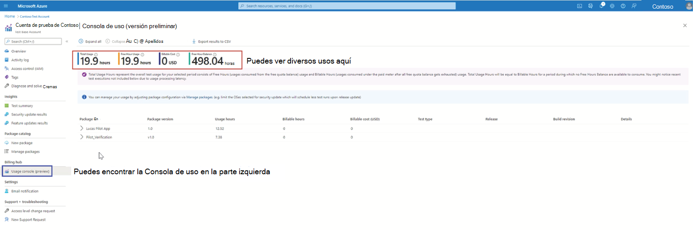
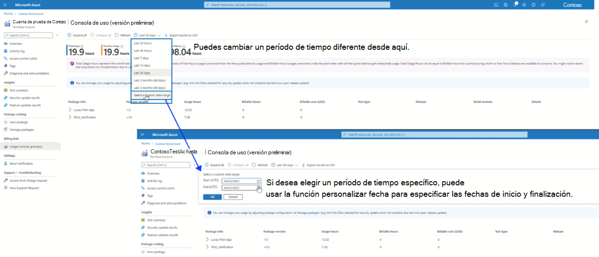
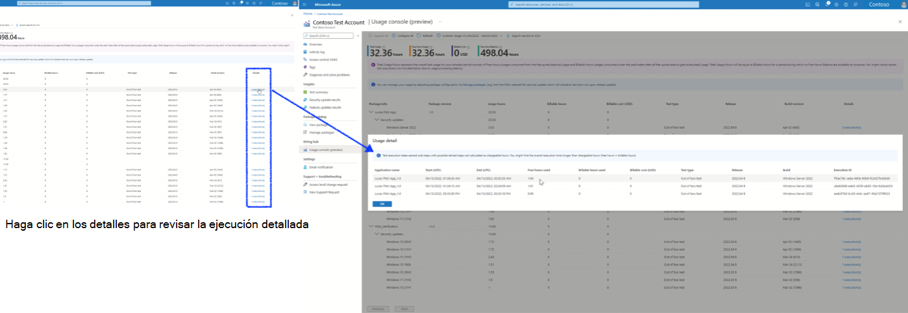

# Comprender el costo de uso

> [!NOTE]
> Test Base ahora ofrece la característica del centro de facturación para ayudar a los usuarios a comprender el uso y el costo de las pruebas.

## Consola de uso en el centro de facturación

Al acceder a la nueva "consola de uso" en la sección "Centro de facturación" del portal, el usuario podrá revisar su uso total para el período seleccionado, el saldo de horas gratis y el costo facturable en función del uso.

**Paso de preparación**

1. Inicie sesión con su cuenta de Test Base.
2. En la barra de navegación de la izquierda, haga clic en Consola de uso en Centro de facturación.

> [!div class="mx-imgBorder"]
> [ Consola de uso ](Media/usagecost01-usage-console.png#lightbox)

Los usuarios pueden cambiar entre diferentes períodos de tiempo o especificar una fecha de finalización de inicio personalizada hasta tres meses a partir de la fecha actual.

> [!div class="mx-imgBorder"]
> [ Tiempo de cambio ](Media/usagecost02-switch-time.png#lightbox)

Los detalles de uso por paquete y tipo de prueba se pueden revisar en la sección inferior después de hacer clic en "Expandir todo". Normalmente, habrá una o varias ejecuciones de prueba para un paquete determinado programado para un tipo de prueba específico en la plataforma de destino.

> [!div class="mx-imgBorder"]
> 

Al hacer clic en la columna "Detalles", aparecerán los registros de ejecución detallados de todas las ejecuciones, incluido el identificador de ejecución, el desglose de la hora de uso por parte de hora libre y la parte de la hora de pago.

> [!div class="mx-imgBorder"]
> [ Registros de ejecución ](Media/usagecost04-execution-records.png#lightbox)

En otro, se proporciona la función Export para descargar el informe de uso detallado con fines de análisis o informes propios.

> [!div class="mx-imgBorder"]
> [ Función De exportación ](Media/usagecost05-export-function.png#lightbox)

> [!NOTE]
> Recuerde que la consola de uso muestra actualmente todos los registros de uso de prueba en el nivel de suscripción. Es posible que observe actividades de prueba de otras cuentas de prueba si tiene más de una cuenta de Test Base recreada en la suscripción.
