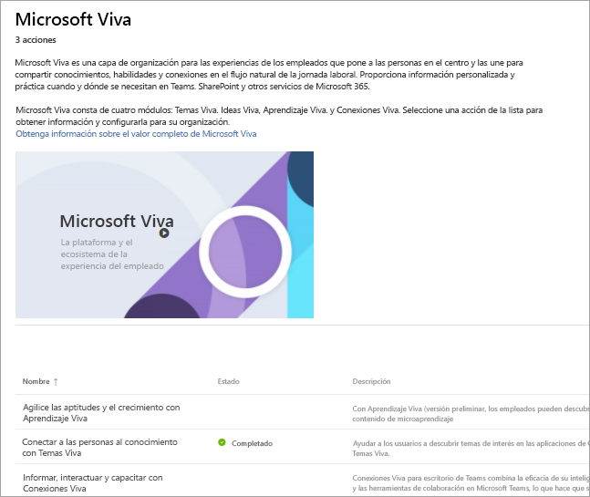

# Configurar Microsoft Viva
Microsoft Viva es una capa de organización para las experiencias de los empleados que pone a las personas en el centro y las une para compartir conocimientos, habilidades y conexiones en el flujo natural de la jornada laboral. Proporciona información personalizada y práctica cuando y dónde se necesitan en Teams, SharePoint y otros servicios de Microsoft 365. 

Microsoft Viva consta de cuatro módulos: Temas Viva, Ideas Viva, Aprendizaje Viva y Conexiones Viva. Para configurar todo el conjunto, configurará cada módulo individualmente.
 
### Empezar a configurar

Para iniciar la configuración, tendrá que ser administrador de Microsoft y haber iniciado sesión en su cuenta. 

[Ir directamente a la página de administrador de Microsoft Viva](https://admin.microsoft.com/Adminportal/Home?source=applauncher#/featureexplorer/collections/VivaExperiences)

En la parte inferior de la página, seleccione el módulo que desea configurar.
En la página del módulo, seleccione el botón **Ir a la guía de configuración** o, en el caso de Temas Viva, seleccione el botón **Comenzar** para ir al Asistente para instalación que le guiará a través del proceso.

O bien, si quiere configurarlo más adelante, puede seguir estos pasos:
1.  Vaya al Centro de administración de Microsoft 365
2.  Seleccione **Configurar** en la navegación izquierda
3.  Seleccione el icono **Microsoft Viva**
4.  En la parte inferior de la página, seleccione el módulo que desea configurar.
5.  Seleccione el botón **Ir a la guía de configuración** o, en el caso de Temas Viva, seleccione el botón **Comenzar** para ir al Asistente para instalación que le guiará a través del proceso.

### Más información
Si desea obtener más información sobre cada módulo y cómo los configurará primero, estos son algunos recursos:

**Viva Learning** 

Acelerar la habilidad y el crecimiento: sus empleados pueden descubrir y compartir fácilmente todo, desde cursos de aprendizaje hasta contenido de microaprendizaje.

[Información general](/microsoft-365/learning)

[Obtenga información sobre cómo configurarlo](/microsoft-365/learning/set-up-teams-admin-center)

**Ideas Viva**

Equilibrar la productividad y el bienestar: proporciona información basada en datos y protegida por la privacidad y recomendaciones accionables que ayudan a todos los miembros de la organización a trabajar de forma más inteligente y lograr el equilibrio.

[Información general](/viva/insights/introduction)

[Obtenga información sobre cómo configurarlo](/viva/insights/setup/setup-intro)

**Temas Viva**

Conectar personas al conocimiento: los usuarios pueden descubrir fácilmente temas de interés dentro de las aplicaciones de Office, SharePoint y resultados de búsqueda.

[Información general](/microsoft-365/knowledge/)

[Obtenga información sobre cómo configurarlo](/microsoft-365/knowledge/set-up-topic-experiences)

**Conexiones Viva**

Informar, atrear y proporcionar: Conexiones Microsoft Viva es la puerta de enlace a una experiencia de compromiso moderna diseñada para mantener a todos comprometidos e informados.

[Información general](/sharepoint/viva-connections-overview)

[Obtenga información sobre cómo configurarlo](/sharepoint/guide-to-setting-up-viva-connections)

**Más información**

[Obtenga documentación adicional y formas de obtener información sobre Microsoft Viva](/microsoft-365/viva)
